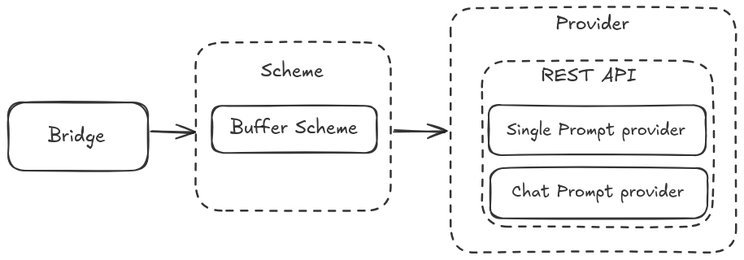

# Prompt Tools

ROS2 meta-package with tools for working with prompted systems such as large language models and their responses in a distributed data driven robotic system application (ROS) including generic ROS message types for LLM prompts.

This package contain one main component,
- [prompt_bridge](./prompt_bridge/readme.md)

## Prompt Bridge

The main system that connects ROS2 data and a LLM. Utilizes Provider plugins for connection interfaces.



## Install

### Dependency Installation

Move to workspace root and run the following command to install dependencies

```bash
cd ..
rosdep install --from-paths src --ignore-src -r -y
```

## Usage

### Using OpenAI api

Run the following command with the actual `OPENAI_API_KEY` in place of `<open-ai-api-key>`
```bash
export PROMPT_PROVIDER_API_KEY="<open-ai-api-key>"
```
and then update the config file with the correct api endpoints and model names and run,

```bash
colcon build
```

### Start the Prompt Bridge

```bash
source install/setup.bash
ros2 launch prompt_bridge prompt_bridge.launch.py
```
