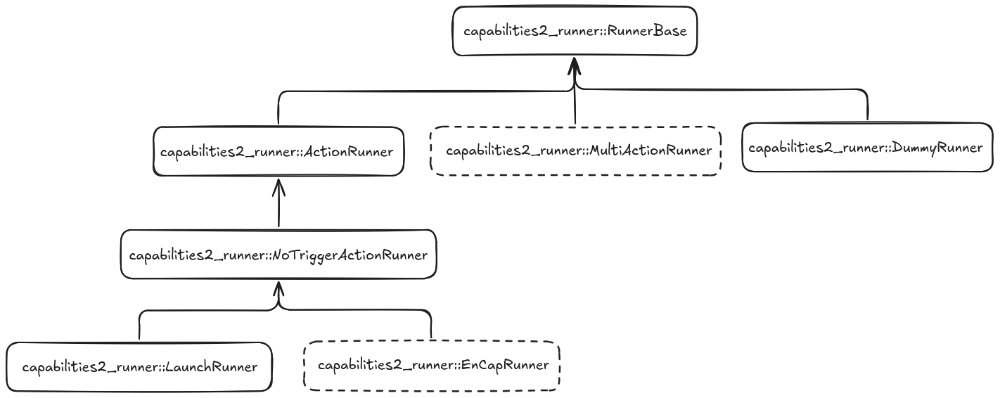

# capabilities2_runner plugin API

This package provides the `runner` API for abstract provision of capabilities. Runner plugins extend the execution functionality of the `capabilities` system. The ROS1 implementation used launch files to start capabilities. The ROS2 implementation uses runners. This allows for more flexibility in how capabilities are started and stopped, or how they are managed, and operate.

## Runner archetypes

The `capabilities2_runner` package provides runner patterns that can be used to specialise runners for capabilities and hence create capabilities. These runners are tested:

| Runner Type | Description |
|-------------|-------------|
| `capabilities2_runner::RunnerBase` | The Base class for runners implementing the `Runner` interface which consists of `start`, `stop` and `trigger` functionality. |
| `capabilities2_runner::ActionRunner` | The Base runner class for capabilities that are implemented as ROS Actions. Overrides `stop` and `trigger` from RunnerBase. |
| `capabilities2_runner::ServiceRunner` | The Base runner class for capabilities that are implemented as ROS Services. |
| `capabilities2_runner::TopicRunner` | The Base runner class for capabilities that are implemented as ROS Topics. |
| `capabilities2_runner::NoTriggerActionRunner` | A Base runner class that is also a derivative of Action Runner which disables trigger functionality. Useful for runners that start executing from the beginning. |

## Standard Runners

The `capabilities2_runner` package provides some standard runners.

| Runner Type | Description |
|-------------|-------------|
| `capabilities2_runner::LaunchRunner` | Runner for capabilities that are implemented as launch files. |
| `capabilities2_runner::DummyRunner` | A sample runner that can be used to test the functionality of capabilities server. |

## System Runners

The `capabilities2_runner_system` package provides system-level runners that can be used to coordinate multiple capabilities through the events system.

| Runner Type | Description |
|-------------|-------------|
| `capabilities2_runner_system::InputMultiplexAny` | A runner that multiplexes multiple input capabilities, allowing any of them to trigger the output. |
| `capabilities2_runner_system::InputMultiplexAll` | A runner that multiplexes multiple input capabilities, requiring all of them to be active to trigger the output. |

## Experimental Runners

The `capabilities2_runner` package provides experimental runners that can be used to start capabilities. These runners are not fully tested and may not work as expected. The experimental runners are:

| Runner Type | Description |
|-------------|-------------|
| `capabilities2_runner::EnCapRunner` | Base runner class that provides a capability action interface that encapsulates another action. |
| `capabilities2_runner::MultiActionRunner` | Base runner class for capabilities that are implemented using multiple actions. |

## Runner Inheritance Diagram

Following inheritance diagram depicts the inheritance between the above presented *Runners* and *Experimental Runners*.



## About Runners

### Base Runner

The `RunnerBase` class is the base class for all runners. It provides the `start`, `stop`, and `trigger` methods. The `start` method is used to start the runner, the `stop` method is used to stop the runner, and the `trigger` method is used to trigger the runner. See the `capabilities2_runner::RunnerBase` class definition function templates below:

```cpp
namespace capabilities2_runner
{

  class RunnerBase
  {
  public:
    // start the runner
    virtual void start(rclcpp::Node::SharedPtr node, const runner_opts& run_config,
                     std::function<void(const std::string&)> on_started = nullptr,
                     std::function<void(const std::string&)> on_terminated = nullptr,
                     std::function<void(const std::string&)> on_stopped = nullptr) = 0;

    // stop the runner
    virtual void stop() = 0;

    // trigger the runner
    virtual std::optional<std::function<void(std::shared_ptr<tinyxml2::XMLElement>)>>
    trigger(std::shared_ptr<tinyxml2::XMLElement> parameters = nullptr) = 0;
  };

} // namespace capabilities2_runner
```

### LaunchRunner

The `Launch Runner` inherits from the `capabilities2_runner::NoTriggerActionRunner` and is a special case. To instantiate this runner, provide a launch file path as the `runner` tag in the capability provider.

```yaml
# provider ...
name: my_provider
spec_version: 1
spec_type: provider
implements: my_capability
# the runner to use is an exported plugin name based on RunnerBase
runner: path/to/launch_file.launch.py
```

### Creating a a Custom runner

The main idea is to allow users to create custom runners for their specific capabilities. Runners can be created to perform capabilities. The runner can be specified in a capability provider as the `runner` tag:

```yaml
# provider ...
name: my_provider
spec_version: 1
spec_type: provider
implements: my_capability
# the runner to use is an exported plugin name based on RunnerBase
runner: capabilities2_runner::MyRunner
```

The runner `capabilities2_runner::MyRunner` should inherit from the `capabilities2_runner::RunnerBase` or another like the `capabilities2_runner::ActionRunner` class. The runner must implement the `start`, `stop`, and `trigger` methods, and then be registered as a plugin, using the `PLUGINLIB_EXPORT_CLASS` macro. See [Creating Runners](./docs/create_runners.md) for more information.

## Runner Execution Patterns

### Start -> Stop

The simplest runner execution pattern is to start the runner and then stop it. An example of this is the `LaunchRunner`. This pattern represents a ***self-contained*** capability. An example might be the action of a robot following another entity. This skill could be self-contained and runs continuously until stopped. This case assumes that the skill is continuously running and does not require any external triggers. ROS **Topic** subscriptions and **Launch** files are like this type.

### Start -> Trigger -> Stop

A more complex runner execution pattern is to start the runner, trigger it, and then stop it. This pattern represents a ***one-shot*** capability. An example might be the action of a robot moving to a waypoint. This skill is triggered once and then stops.

### Start -> Trigger -> Trigger -> ... -> Stop

An even more complex runner execution pattern is to start the runner, trigger it multiple times, and then stop it. This pattern represents a ***repeating*** capability. An example might be the action of a robot completing a state-machine or tree. This skill is triggered multiple times and then stops. This pattern (and the previous one) often implies that data is passed to and from the runner.

### Start -> End (no Stop)

The final runner execution pattern is to start the runner and then end it without stopping. This pattern represents a challenge for the runner API, as it is not clear when the runner should be stopped. ROS communications patterns including **Services** and **Actions** are like this type.

## Trigger Parameter Format

Runners can use parameters. These parameters are passed to the runner in the `trigger` function. For more information, see [Parameter Format](./docs/parameter_format.md).
