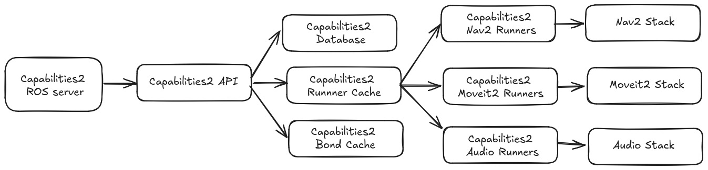

# Capabilities2


[](https://index.ros.org/doc/ros2/Releases/)

[](https://open.vscode.dev/collaborativeroboticslab/capabilities2)
[](https://opensource.org/licenses/MIT)

A reimplementation of the [capabilities](https://github.com/osrf/capabilities) package. This package is implemented using `C++` and extends the capabilities package features.

- [capabilities2_server](./capabilities2_server/readme.md) package contains the core of the system.
- [capabilities2_runner](./capabilities2_server/readme.md) package contains base and template classes for capability implementations.

## System structure



## Entities

The main usage of `capabilities2` will typically involve creating or customizing capabilities through providers, interfaces and semantic interfaces. These are stored as YAML, and for more information about definitions and examples, click the links:

| Entity | Description |
| --- | --- |
| [Interfaces](./docs/interfaces.md) | The main capability specification file |
| [Providers](./docs/providers.md) | The capability provider specification file provides a mechanism to operate the capability |
| [Semantic Interfaces](./docs/semantic_interfaces.md) | The semantic interface specification file provides a mechanism to redefine a capability with semantic information |

Runners can be created using the runner API parent classes [here](./capabilities2_runner/readme.md). The capabilities service can be started using the [capabilities2_server](./capabilities2_server/readme.md) package.

## Setup Information

- [Installation](./docs/setup.md)
- [Setup Instructions with devcontainer](./docs/setup_with_dev.md)
- [Dependency installation for Foxglove-studio](./docs/foxglove_studio.md)

## Quick Startup information

### Starting the Capabilities2 server

```bash
source install/setup.bash
ros2 launch capabilities2_server capabilities2_server.launch.py
```

## Additional Information

- [Motivation and Example Use Cases](./docs/motivation_and_examples.md)
- [Design Information](./docs/design.md)
- [Registering a capability](./capabilities2_server/docs/register.md)
- [Terminal based capability usage](./capabilities2_server/docs/terminal_usage.md)
- [Running test scripts](./docs/run_test_scripts.md)

## Acknowledgements

This work is based on the capabilities package developed by the Open Source Robotics Foundation. [github.com/osrf/capabilities](https://github.com/osrf/capabilities).

## Citation

If you use this work in an academic context, please cite the following publication(s):

[Capabilities2 for ROS2: Advanced Skill-Based Control for Human-Robot Interaction](https://dl.acm.org/doi/10.5555/3721488.3721623)

```latex
@inproceedings{10.5555/3721488.3721623,
    author = {Pritchard, Michael and Ratnayake, Kalana and Gamage, Buddhi and Jayasuriya, Maleen and Herath, Damith},
    title = {Capabilities2 for ROS2: Advanced Skill-Based Control for Human-Robot Interaction},
    year = {2025},
    publisher = {IEEE Press},
    booktitle = {Proceedings of the 2025 ACM/IEEE International Conference on Human-Robot Interaction},
    pages = {1067–1071},
    location = {Melbourne, Australia},
    series = {HRI '25}
}
```
