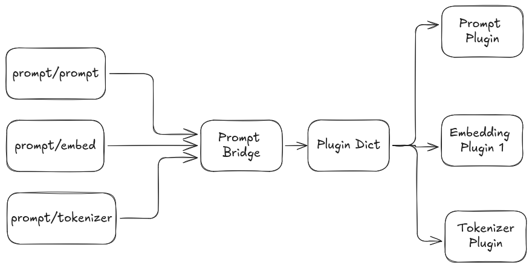

# Prompt Tools

[](https://index.ros.org/doc/ros2/Releases/)
[](https://index.ros.org/doc/ros2/Releases/)
[](./LICENSE)
[](https://open.vscode.dev/CollaborativeRoboticsLab/prompt_tools)
<!-- [](https://doi.org/10.1/zenodo.1) -->

ROS2 meta-package with tools for working with prompted systems such as large language models and their responses in a distributed data driven robotic system application (ROS) including generic ROS message types for LLM prompts.  Provides a flexible, plugin-based interface for prompting, embedding and tokenization via plugins. Currently supports following providers

| Provider | Package |
| --- | --- |
| OpenAI | [prompt_openai](./prompt_openai/readme.md)  |
| Ollama | [prompt_ollama](./prompt_ollama/readme.md)  |

## Motivation

`prompt_bridge` is designed to provide a generic, extensible interface for integrating prompted systems (e.g., LLMs) into ROS 2 robotic applications. It follows ROS best practices by using a plugin architecture, allowing different LLM providers to be loaded at runtime. This enables rapid experimentation and integration of new models and providers without changing core code.

## Features

- **Plugin-based architecture:** Easily add new LLM providers or prompt schemes via plugins.
- **Unified ROS interfaces:** Provides ROS services for sending prompts and receiving responses.
- **Prompt history tracking:** Publishes prompt/response history for monitoring and debugging.
- **Chat and cache modes:** Supports conversational (chat) and stateless prompt handling, with optional caching and flushing.
- **Dynamic configuration:** Model families and plugins are loaded at runtime from parameters or YAML config.

<br>

## Prompt Bridge

The main system that connects ROS2 system and a LLM. Utilizes plugins for connection interfaces. Currently support parallel connections with Prompt Interfaces, Embedding Interfaces and Tokenization interfaces.

- **Prompt Interfaces:** 
    - `prompt/prompt` ([prompt_msgs/srv/Prompt](prompt_msgs/srv/Prompt.srv))
    - Main entry point for sending prompts and receiving responses.

- **Embedding Interfaces:** 
    - `prompt/embedding` ([prompt_msgs/srv/Embedding](prompt_msgs/srv/Embedding.srv))
    - Main entry point for requesting embedding vectors for text.

- **Tokenization interfaces:** 
    - `prompt/tokenizer` ([prompt_msgs/srv/Tokenize](prompt_msgs/srv/Tokenize.srv))
    - Main entry point for encoding text to tokens and decoding tokens into text.

- **History Publisher:** 
    - `prompt/history` ([prompt_msgs/msg/PromptHistory](prompt_msgs/msg/PromptHistory.msg))
    - Publishes a rolling history of prompt transactions.

Following is the current system Architecture



## Read more about,

- [Prompt Interface](./docs/prompt_interface.md) to understand about Prompting Sub System
- [Embed Interface](./docs/embed_interface.md) to understand about Embedding Sub System
- [Tokenize Interface](./docs/tokenize_interface.md) to understand about PromptTokenizer Sub System
- [Class Inheritance](./docs/class_structure.md)  to understand how to inherit when creating new plugins
- [Plugin parameters](./docs/plugin_parameters.md)  to understand how to configure new and existing plugins to change behaviour

<br>

## Install

### Initialize submodules

```bash
cd prompt_tools
git submodule update --init --recursive
```

### Dependency Installation

```bash
sudo apt update && sudo apt install -y libuuid-dev
```

Move to workspace root and run the following command to install dependencies

```bash
cd ../..
rosdep install --from-paths src --ignore-src -r -y
```

<br>

## API Keys

### Using OpenAI api

Run the following command with the actual `OPENAI_API_KEY` in place of `<open-ai-api-key>` if using prompt-openai plugins

```bash
export OPENAI_API_KEY="<open-ai-api-key>"
```

and then update the config file with the correct api endpoints and model names and run,

```bash
colcon build
```

### Using the devcontainer

Rename the `.devcontainer/devcontainer-empty.env` as `.devcontainer/devcontainer.env` and update it with your API Keys. Then rebuild the container


<br>

## Usage

### Starting the Prompt Bridge

```bash
source install/setup.bash
ros2 launch prompt_bridge prompt_bridge.launch.py
```

### Testing

To build and run the test node that exercises all features of prompt_bridge:

```bash
source install/setup.bash
ros2 run prompt_bridge test_prompt_node
```

This will run the test node and print results for stateless, chat, caching, and model selection features.
