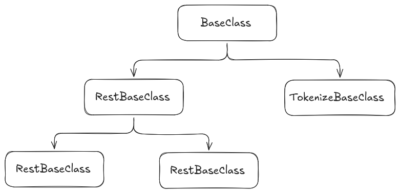

# Class Structure: prompt_base Package

This document provides an overview of the main classes and their relationships in the `prompt_base` package. The package is designed to provide base classes and utilities for prompt handling, embedding, REST interfaces, and tokenization.

## Main Classes

### 1. BaseClass

Defines the fundamental base class for prompt operations. This class provides core virtual methods and interfaces that other classes extend.

### 2. RestBaseClass

Inherits from the BaseClass and provides a foundation for RESTful service integration. It provides methods for handling REST requests and responses, enabling prompt services to be exposed over HTTP APIs.

### 3. PromptBaseClass

Inherits from the RestBaseClass and provides a foundation for prompt handling plugins. It includes methods for managing prompt input and output, and is intended to be extended by specific prompt providers.

### 4. EmbedBaseClass

Inherits from the RestBaseClass and provides a foundation for embedding handling plugins. It includes methods for managing emnedding requests, and is intended to be extended by specific embedding providers.

### 5. TokenizeBaseClass

Inherits from BaseClass and provides foundation for tokenization operations. It provides interfaces for converting text to tokens and vice versa, supporting various tokenization strategies. Current implementation only provides an standardized interface to connect local software, but in future can be extended for RESTful services.

## Utilities

Located in `include/prompt_base/utils/`, these headers provide supporting structures and functions:

- `conversions.hpp`: Utility functions for data conversion between types.
- `exceptions.hpp`: Custom exception classes for error handling in prompt operations.
- `prompt_options.hpp`: Structures and functions for managing options and configurations that are directly loaded into Json as configuration.
- `structs.hpp`: Common data structures used across the base classes.

## Relationships

- All specialized base classes (`embed_base_class`, `prompt_base_class`, `rest_base_class`, `tokenize_base_class`) typically inherit from or utilize the core functionality defined in `base_class.hpp`.
- Utility headers are included as needed to support functionality in the main classes.

## Extensibility

The package is designed for extensibility, allowing developers to implement custom prompt providers, embedders, REST services, and tokenizers by inheriting from these base classes and overriding their virtual methods.