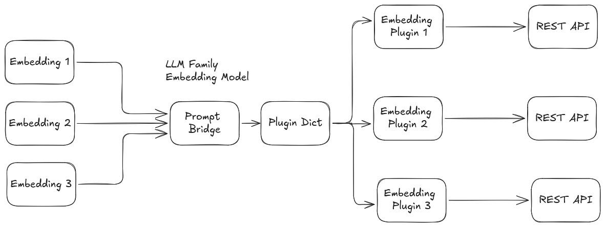

# Service Interface: `prompt/embedding`

The embedding service interface is `prompt/embedding`, using the [Embedding.srv](../prompt_msgs/srv/Embedding.srv) definition. Capable of supporting, loading and running plugins for multiple Embedding service vendors concurrently. Current system architecture is as follows.



## Service Definition

```
prompt_msgs/Embed input
---
prompt_msgs/EmbedResponse output
```

### Request Fields
| Field     | Type      | Description                                              |
|-----------|-----------|----------------------------------------------------------|
| `input`   | [Embed](../prompt_msgs/msg/Embed.msg) | The embedding request message. |

#### Embed.msg Fields
| Field           | Type      | Description                                      |
|-----------------|-----------|--------------------------------------------------|
| `text`          | string    | The input text to embed.                         |
| `model_family`  | string    | Model family/provider to use (e.g., openai).     |
| `options`       | [ModelOption[]](../prompt_msgs/msg/ModelOption.msg) | Model-specific options. |

### Response Fields
| Field     | Type      | Description                                              |
|-----------|-----------|----------------------------------------------------------|
| `output`  | [EmbedResponse](../prompt_msgs/msg/EmbedResponse.msg) | The embedding response. |

#### EmbedResponse.msg Fields
| Field         | Type      | Description                                         |
|---------------|-----------|-----------------------------------------------------|
| `embeddings`  | [Embedding[]](../prompt_msgs/msg/Embedding.msg) | List of embeddings. |
| `success`     | bool      | True if embedding was successful.                   |
| `error`       | string    | Error message if failed.                            |
| `model`       | string    | Model used.                                        |
| `prompt_tokens`| int64    | Number of prompt tokens used.                       |
| `total_tokens` | int64    | Total tokens used.                                 |

#### Embedding.msg Fields
| Field             | Type      | Description                                        |
|-------------------|-----------|----------------------------------------------------|
| `float_embedding` | float32[] | Embedding as float array (if `is_float` true).     |
| `base64_embedding`| string    | Embedding as base64 string (if `is_float` false).  |
| `is_float`        | bool      | True if float, false if base64.                    |
| `index`           | int64     | Index of the embedding.                            |

#### ModelOption.msg Fields
| Field   | Type   | Description                        |
|---------|--------|------------------------------------|
| `key`   | string | Option key                         |
| `value` | string | Option value                       |
| `type`  | string | Type hint (e.g., str, bool, int)   |

## How to Use the Service

- Set `text` to the string you want to embed.
- Set `model_family` to the provider/plugin (e.g., `openai`, `ollama`).
- Use `options` for model-specific parameters (see [plugin_parameters.md](plugin_parameters.md)).

## Example Request (YAML)

```yaml
input:
	text: "The quick brown fox jumps over the lazy dog."
	model_family: "openai"
	options: [("model", "text-embedding-3-small"), ("dimensions", "1536")]
```


## Extending

To add a new Online Embedding provider, implement a plugin inheriting from `prompt::EmbedBaseClass` and register it. Add its configuration to your YAML file and list it in `embedding_family_names` and `embedding_family_plugins`.


## Notes
- The service returns one or more embeddings for the input text.
- Embeddings may be returned as float arrays or base64 strings, depending on the model and configuration.
- Use the `success` and `error` fields to check for errors.
