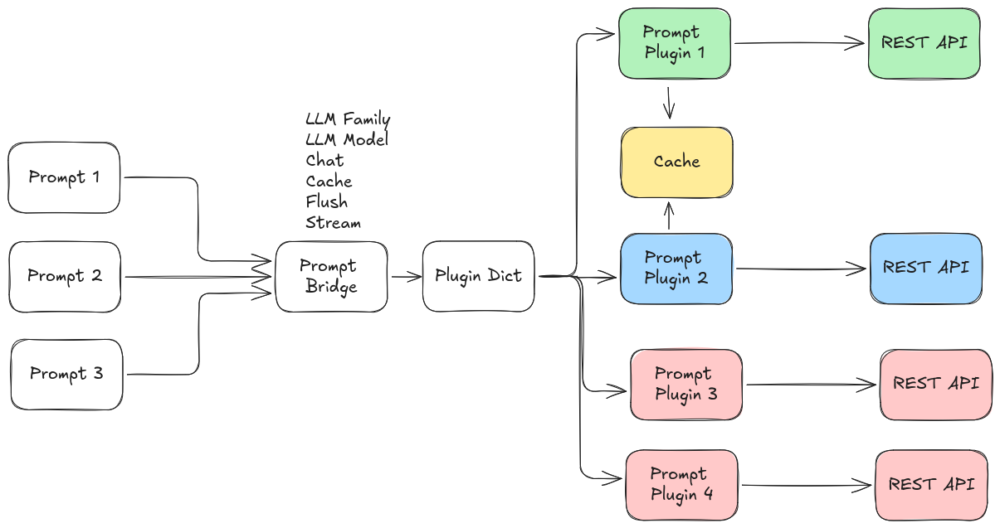
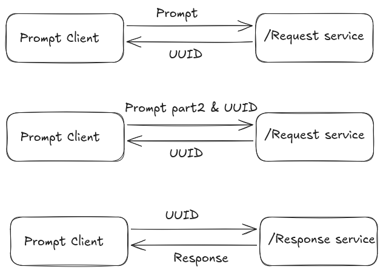

# Service Interface: `prompt/prompt`

The main service interface for sending prompts and receiving responses is `prompt/prompt`, using the [Prompt.srv](../prompt_msgs/srv/Prompt.srv) definition. Capable of supporting, loading and running plugins for multiple LLM service vendors concurrently. Current system architecture is as follows.



## Service Definition

```
string uuid
prompt_msgs/Prompt prompt
---
string uuid
prompt_msgs/PromptResponse response
```

### Request Fields
| Field         | Type                    | Description                                                                 |
|-------------- |------------------------|-----------------------------------------------------------------------------|
| `uuid`        | string                  | (Optional) Conversation/session ID. Use empty string for new prompt/session. |
| `prompt`      | [Prompt](../prompt_msgs/msg/Prompt.msg) | The prompt message and options.                                              |


#### Prompt.msg Fields
| Field            | Type      | Description                                                                 |
|------------------|-----------|-----------------------------------------------------------------------------|
| `prompt`         | string    | The prompt text to send.                                                    |
| `use_cache`      | bool      | Whether to cache this prompt (for multi-turn or multi-input).               |
| `flush_cache`    | bool      | Whether to flush the cache and process all cached prompts.                  |
| `use_chat_mode`  | bool      | Enable chat/conversational mode (tracks dialogue history).                  |
| `model_family`   | string    | Which model family/provider to use (e.g., `openai`, `ollama`).              |
| `options`        | [ModelOption[]](../prompt_msgs/msg/ModelOption.msg) | Additional model-specific options (e.g., temperature, model name).          |

#### ModelOption.msg Fields
| Field   | Type   | Description                        |
|---------|--------|------------------------------------|
| `key`   | string | Option key                         |
| `value` | string | Option value                       |
| `type`  | string | Type hint (e.g., str, bool, int)   |

### Response Fields
| Field         | Type                    | Description                                                                 |
|---------------|------------------------|-----------------------------------------------------------------------------|
| `uuid`        | string                  | The session/conversation ID (for chat/cached prompts).                      |
| `response`    | [PromptResponse](../prompt_msgs/msg/PromptResponse.msg) | The response message.                   |

#### PromptResponse.msg Fields
| Field         | Type      | Description                                                                 |
|---------------|-----------|-----------------------------------------------------------------------------|
| `response`    | string    | The generated response text.                                                |
| `buffered`    | bool      | True if the response is buffered (not final, e.g., when caching).           |
| `success`     | bool      | True if the prompt was processed successfully.                              |
| `accuracy`    | float64   | (Optional) Accuracy metric (if provided by model).                          |
| `confidence`  | float64   | (Optional) Confidence metric.                                               |
| `risk`        | float64   | (Optional) Risk metric.                                                     |

## How to Use the Service



### 1. Single prompt (stateless):
- Set `uuid` to empty string.
- Set `use_cache` and `use_chat_mode` to `false` in the prompt.
- The response will be processed immediately and returned.

### 2. Chat mode (multi-turn conversation):
- Set `use_chat_mode` to `true` in the prompt.
- For a new conversation, set `uuid` to empty string. The response will include a new `uuid` for the session.
- For follow-up prompts, set `uuid` to the previous response's `uuid` to continue the conversation.

### 3. Prompt caching (multi-input aggregation):
- Set `use_cache` to `true` and `flush_cache` to `false` to cache prompts (without processing), a `uuid` will be returned on the response to access the cache in future.
- Set `use_cache` to `true` and `flush_cache` to `true` to process all cached prompts for the session (requires `uuid`).

### 4. Model selection and options:
- Set `model_family` to select the provider/plugin (e.g., `openai`, `ollama`).
- Use the `options` array to specify model-specific parameters (see [plugin_parameters.md](plugin_parameters.md)).

## Example Request (YAML)

```yaml
uuid: ""
prompt:
  prompt: "What is the capital of France?"
  use_cache: false
  flush_cache: false
  use_chat_mode: false
  model_family: "openai"
  options: []
```

## Extending

To add a new Online Prompt provider, implement a plugin inheriting from `prompt::PromptBaseClass` and register it. Add its configuration to your YAML file and list it in `prompt_family_names` and `prompt_family_plugins`.


## Notes
- The service is designed to support both stateless and conversational (chat) interactions.
- Use the `uuid` field to manage sessions for chat or caching.
- The callback logic in the node handles all combinations of chat/caching/flush, and will return the appropriate response and session ID.
