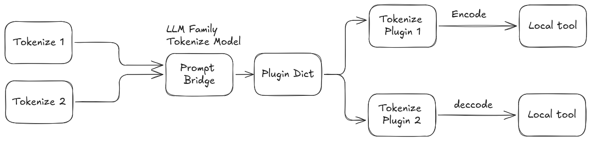

# Service Interface: `prompt/tokenize`

The tokenization service interface is `prompt/tokenize`, using the [Tokenize.srv](../prompt_msgs/srv/Tokenize.srv) definition. Capable of supporting, loading and running plugins for multiple tokenization tools concurrently. Current system architecture is as follows.



## Service Definition

```
prompt_msgs/Token input
---
prompt_msgs/TokenResponse output
```

### Request Fields
| Field     | Type      | Description                                              |
|-----------|-----------|----------------------------------------------------------|
| `input`   | [Token](../prompt_msgs/msg/Token.msg) | The tokenization request message. |

#### Token.msg Fields
| Field           | Type      | Description                                      |
|-----------------|-----------|--------------------------------------------------|
| `text`          | string    | String to be tokenized (if encoding).            |
| `tokens`        | int32[]   | Tokens to be decoded (if decoding).              |
| `encode`        | bool      | True to encode text to tokens, false to decode.  |
| `model_family`  | string    | Model family/provider to use (e.g., openai).     |
| `options`       | [ModelOption[]](../prompt_msgs/msg/ModelOption.msg) | Model-specific options. |

### Response Fields
| Field     | Type      | Description                                              |
|-----------|-----------|----------------------------------------------------------|
| `output`  | [TokenResponse](../prompt_msgs/msg/TokenResponse.msg) | The tokenization response. |

#### TokenResponse.msg Fields
| Field         | Type      | Description                                         |
|---------------|-----------|-----------------------------------------------------|
| `tokens`      | int32[]   | List of tokens (if encoding).                       |
| `text`        | string    | Decoded text (if decoding).                         |
| `success`     | bool      | True if conversion was successful.                  |
| `error`       | string    | Error message if failed.                            |

#### ModelOption.msg Fields
| Field   | Type   | Description                        |
|---------|--------|------------------------------------|
| `key`   | string | Option key                         |
| `value` | string | Option value                       |
| `type`  | string | Type hint (e.g., str, bool, int)   |

## How to Use the Service

- To encode: set `text` to your string, `encode` to `true`, and leave `tokens` empty.
- To decode: set `tokens` to your token list, `encode` to `false`, and leave `text` empty.
- Set `model_family` to the provider/plugin (e.g., `openai`, `ollama`).
- Use `options` for model-specific parameters (see [plugin_parameters.md](plugin_parameters.md)).

## Example Request (YAML)

Encoding example:
```yaml
input:
	text: "Hello world!"
	tokens: []
	encode: true
	model_family: "openai"
	options: [("model", "O200K_BASE")]
```

Decoding example:
```yaml
input:
	text: ""
	tokens: [15496, 995]
	encode: false
	model_family: "openai"
	options: [("model", "O200K_BASE")]
```


## Extending

To add a new Offline Tokenizer provider, implement a plugin inheriting from `prompt::TokenizeBaseClass` and register it. Add its configuration to your YAML file and list it in `tokenizer_family_names` and `tokenizer_family_plugins`.

## Notes
- The service can encode text to tokens or decode tokens to text, depending on the `encode` flag.
- Use the `success` and `error` fields to check for errors.
