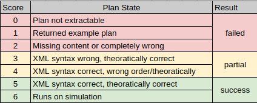

# ICRA 2026 Fabric vs BTGenBot comparison

## Setup

Create a python virtual environment

```bash 
python3 -m venv .venv
source .venv/bin/activate
```

Install Dependencies

```bash
pip install -r requirements.txt
```

## Running ICRA2026 related evaluations

Activate the venv
```bash
source .venv/bin/activate
```
Following commands will run the code for each of the tasks available in the tasks folder and write the corresponding plan to workspace/src/bt_client/bt_xml folder with filename format of `<model>-<zero>-<original_filename>-<iteration>.xml`

### BT

Move in to the BTGenBot folder
```bash
cd BTGenBot
```

To run the BT generation with llamachat
```bash
export HF_TOKEN="your_hugging_face_token_here"
python3 inference-llamachat.py >> logs/llamachat-rawlog.log
```

To run the BT generation with codellama
```bash
export HF_TOKEN="your_hugging_face_token_here"
python3 inference-codellama.py >> logs/codellama-rawlog.log
```

To run the BT generation with openai models select the correct file
```bash
export OPENAI_API_KEY="your_openai_key_here"
python3 inference-openai-4o.py >> logs/openai-4o-rawlog.log
python3 inference-openai-4.1.py >> logs/openai-4.1-rawlog.log
python3 inference-openai-5.py >> logs/openai-5-rawlog.log
```

### Fabric

Move in to the Fabric folder
```bash
cd Fabric
```

To run the generation with llamachat
```bash
export HF_TOKEN="your_hugging_face_token_here"
python3 inference-llamachat.py >> logs/llamachat-rawlog.log
```

To run the generation with codellama
```bash
export HF_TOKEN="your_hugging_face_token_here"
python3 inference-codellama.py >> logs/codellama-rawlog.log
```

To run the generation with openai
```bash
export OPENAI_API_KEY="your_openai_key_here"
python3 inference-openai-4o.py >> logs/openai-4o-rawlog.log
python3 inference-openai-4.1.py >> logs/openai-4.1-rawlog.log
python3 inference-openai-5.py >> logs/openai-5-rawlog.log
```

Prompts and results will be printed onto the terminal.

Data used for evaluation will be available on output-eval and logs-eval folders

## Evaluation

### Extract execution times

Run the following files to extract timing data as txt and csv files.

Fabric
```bash
cd Fabric
python3 extract-execution-time.py
```

BTGenBot
```bash
cd BTGenBot
python3 extract-execution-time.py
```

### Plan Eval Criteria

Current Evaluations were done by 3 human evaluators who follows the below scoring approach and attempted to
score related to next sections ideal results.



Once the scoring was done by each individual, the data was aggregated to reduce the semantics that can occur 
due to human nature. Then the results were condensed as shown in the above image.

### Ideal results

Tasks are available in `BTGenBot/tasks/` and `Fabric/tasks` folders

#### Task 1 (Generative 1)

Fabric

```xml
<Plan>
  <Control type="sequential" name="move_to_target">
    <Runner interface="capabilities2_runner_nav2/WaypointRunner" provider="capabilities2_runner_nav2/WaypointRunner" x="2.0" y="-0.5" />
  </Control>
</Plan>
```

BTGenBot
```xml
<root main_tree_to_execute = "MainTree" >
    <BehaviorTree ID="MainTree">
        <Sequence>
            <MoveTo location="StationA"/>
        </Sequence>
    </BehaviorTree>
</root>
```

#### Task 2 (Generative 2)

Fabric

```xml
<Plan>
  <Control type="sequential" name="navigate_waypoints">
    <Runner interface="capabilities2_runner_nav2/WaypointRunner" provider="capabilities2_runner_nav2/WaypointRunner" x="2.0" y="-0.5" />
    <Runner interface="capabilities2_runner_nav2/WaypointRunner" provider="capabilities2_runner_nav2/WaypointRunner" x="0.0" y="2.0" />
    <Runner interface="capabilities2_runner_nav2/WaypointRunner" provider="capabilities2_runner_nav2/WaypointRunner" x="-2.0" y="0.0" />
    <Runner interface="capabilities2_runner_nav2/WaypointRunner" provider="capabilities2_runner_nav2/WaypointRunner" x="0.0" y="-2.0" />
  </Control>
</Plan>
```

BTGenBot
```xml
<root main_tree_to_execute = "MainTree" >
    <BehaviorTree ID="MainTree">
        <Sequence>
            <MoveTo location="StationA"/>
            <MoveTo location="StationB"/>
            <MoveTo location="StationC"/>
            <MoveTo location="StationD"/>
        </Sequence>
    </BehaviorTree>
</root>
```

#### Task 3 (Generative 3)

Fabric

```xml
<Plan>
  <Control type="sequential" name="main_execution_plan">
    <Runner interface="capabilities2_runner_nav2/WaypointRunner" provider="capabilities2_runner_nav2/WaypointRunner" x="2.0" y="-0.5" />
    <Runner interface="capabilities2_runner_nav2/WaypointRunner" provider="capabilities2_runner_nav2/WaypointRunner" x="1.0" y="3.0" />
    <Control type="recovery" name="recover_if_1_0_3_0_unreachable">
      <Runner interface="capabilities2_runner_nav2/WaypointRunner" provider="capabilities2_runner_nav2/WaypointRunner" x="0.0" y="2.0" />
    </Control>
    <Runner interface="capabilities2_runner_nav2/WaypointRunner" provider="capabilities2_runner_nav2/WaypointRunner" x="-2.0" y="0.0" />
    <Runner interface="capabilities2_runner_nav2/WaypointRunner" provider="capabilities2_runner_nav2/WaypointRunner" x="0.0" y="-2.0" />
  </Control>
</Plan>
```

BTGenBot
```xml
<root main_tree_to_execute="MainTree">
    <BehaviorTree ID="MainTree">
        <Sequence>
            <MoveTo location="StationA"/>
            <Fallback>
                <MoveTo location="StationE"/>
                <MoveTo location="StationB"/>
            </Fallback>
            <MoveTo location="StationC"/>
            <MoveTo location="StationD"/>
        </Sequence>
    </BehaviorTree>
</root>
```

#### Task 4 (Generative 4)

Fabric

```xml
<Plan>
  <Control type="sequential" name="main_execution_plan">
    <Runner interface="capabilities2_runner_nav2/WaypointRunner" provider="capabilities2_runner_nav2/WaypointRunner" x="2.0" y="-0.5" />
    <Runner interface="capabilities2_runner_nav2/WaypointRunner" provider="capabilities2_runner_nav2/WaypointRunner" x="1.0" y="3.0" />
    <Control type="recovery" name="recovery_for_1_0_3_0">
      <Runner interface="capabilities2_runner_nav2/WaypointRunner" provider="capabilities2_runner_nav2/WaypointRunner" x="0.0" y="2.0" />
    </Control>
    <Runner interface="capabilities2_runner_nav2/WaypointRunner" provider="capabilities2_runner_nav2/WaypointRunner" x="-3.0" y="-1.0" />
    <Control type="recovery" name="recovery_for_-3_0_-1_0">
      <Runner interface="capabilities2_runner_nav2/WaypointRunner" provider="capabilities2_runner_nav2/WaypointRunner" x="-2.0" y="0.0" />
    </Control>
    <Runner interface="capabilities2_runner_nav2/WaypointRunner" provider="capabilities2_runner_nav2/WaypointRunner" x="0.0" y="-2.0" />
  </Control>
</Plan>
```

BTGenBot
```xml
<root main_tree_to_execute="MainTree">
    <BehaviorTree ID="MainTree">
        <Sequence>
            <MoveTo location="StationA"/>
            <Fallback>
                <MoveTo location="StationE"/>
                <MoveTo location="StationB"/>
            </Fallback>
            <Fallback>
                <MoveTo location="StationF"/>
                <MoveTo location="StationC"/>
            </Fallback>
            <MoveTo location="StationD"/>
        </Sequence>
    </BehaviorTree>
</root>
```

#### Task 5 (Generative 5)

Fabric

```xml
<Plan>
  <Control type="sequential" name="main_execution_plan">
    <Runner interface="capabilities2_runner_nav2/WaypointRunner" provider="capabilities2_runner_nav2/WaypointRunner" x="2.0" y="-0.5" />
    <Control type="recovery" name="recover_from_point_1_failure">
      <Runner interface="capabilities2_runner_nav2/WaypointRunner" provider="capabilities2_runner_nav2/WaypointRunner" x="0.0" y="2.0" />
    </Control>
    <Runner interface="capabilities2_runner_nav2/WaypointRunner" provider="capabilities2_runner_nav2/WaypointRunner" x="1.0" y="3.0" />
    <Control type="recovery" name="recover_from_point_2_failure">
      <Runner interface="capabilities2_runner_nav2/WaypointRunner" provider="capabilities2_runner_nav2/WaypointRunner" x="0.0" y="2.0" />
    </Control>
    <Runner interface="capabilities2_runner_nav2/WaypointRunner" provider="capabilities2_runner_nav2/WaypointRunner" x="-3.0" y="-1.0" />
    <Control type="recovery" name="recover_from_point_3_failure">
      <Runner interface="capabilities2_runner_nav2/WaypointRunner" provider="capabilities2_runner_nav2/WaypointRunner" x="-2.0" y="0.0" />
    </Control>
    <Runner interface="capabilities2_runner_nav2/WaypointRunner" provider="capabilities2_runner_nav2/WaypointRunner" x="0.0" y="-2.0" />
    <Control type="recovery" name="recover_from_point_4_failure">
      <Runner interface="capabilities2_runner_nav2/WaypointRunner" provider="capabilities2_runner_nav2/WaypointRunner" x="-2.0" y="0.0" />
    </Control>
  </Control>
</Plan>
```

BTGenBot
```xml
<root main_tree_to_execute="MainTree">
    <BehaviorTree ID="MainTree">
        <Sequence>
            <Fallback>
                <MoveTo location="StationA"/>
                <MoveTo location="StationB"/>
            </Fallback>
            <Fallback>
                <MoveTo location="StationE"/>
                <MoveTo location="StationB"/>
            </Fallback>
            <Fallback>
                <MoveTo location="StationF"/>
                <MoveTo location="StationC"/>
            </Fallback>
            <Fallback>
                <MoveTo location="StationD"/>
                <MoveTo location="StationC"/>
            </Fallback>
        </Sequence>
    </BehaviorTree>
</root>
```